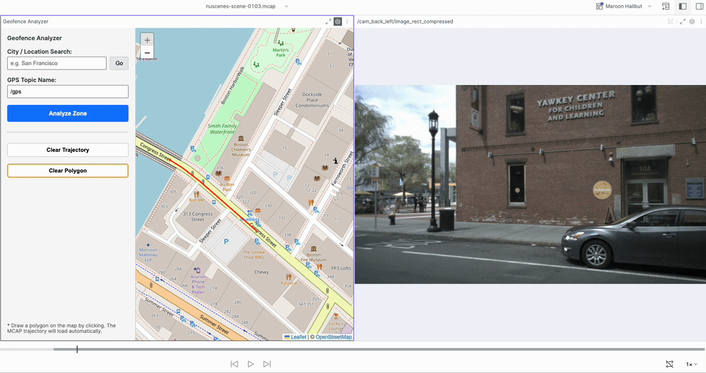
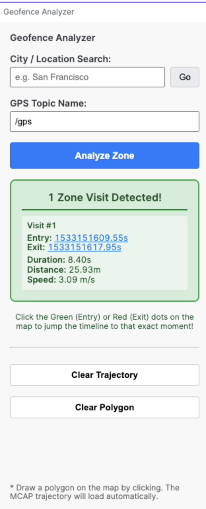

# Foxglove Geofence Analyzer
**Architected by Libby L.**

A Foxglove Studio Panel Extension that brings geospatial intelligence to robotics data. Draw virtual zones on a live map and instantly analyze when, where, and how fast your robot moved through them.




## Example Use Cases

* **Hazard & Keep-Out Zones:** Draw a polygon denoting a Hazard area to determine whether and when your robot enters it. See it visually and click the result to jump directly to the Entry/Exit timestamp.
* **Intersection & Traffic Light Analysis (AVs):** Draw a polygon around a complex four-way intersection. Instantly find the exact timestamps the car traversed it to evaluate your planner's yielding and stop-line behavior.
* **Speed Limit & School Zone Compliance:** Because the tool calculates *Average Speed* inside the zone, you can draw a geofence around a known school zone or construction site to instantly verify if the autonomous vehicle respected the reduced speed limits.
* **Loading Dock Logistics (AMRs & Delivery):** Draw a zone around a warehouse loading bay or drop-off point. The tool's *Duration* metric instantly tells you exactly how long the robot loitered or idled in the bay, helping analyze operational efficiency.
* **GPS "Urban Canyon" Dead Zones:** Draw a geofence over a known tunnel or downtown area with tall buildings. Click the entry timestamp to instantly jump to your 3D LiDAR/Camera panels to see how your localization stack handled the sudden drop in GPS quality.

## Key Features

* 🌎 **Global City Search:** Instantly fly the map anywhere in the world using free OpenStreetMap geocoding.
* 📐 **Interactive Geofencing:** Click to draw custom polygons on the map.
* ⚡️ **Instant Analysis:** Powered by `Turf.js` to instantly calculate **Duration**, Metric Distance, and Average **Speed** for every visit (displayed in the Sidebar Stats).
* ⏱ **Jump to Time, for both entry and exit:** Click any Entry or Exit timestamp in the results to instantly synchronize your Foxglove 3D and Camera panels to that exact millisecond.



## Installation

1. Go to the [Releases](https://github.com/hippopond/foxglove-geofence-analyzer/releases) page and download the latest `.foxe` file.
2. Open Foxglove Studio and navigate to **Settings > Extensions**.
3. Click **Install Extension** and select the downloaded `.foxe` file.
4. Open a new panel in your Foxglove layout and select **Geofence Analyzer**.

## Quick Start Guide

1. **Set Topic:** Ensure the GPS Topic Name matches your recording (defaults to `/gps`). 
   * *Note: The topic must use the standard `foxglove.LocationFix` schema (or any custom message containing `latitude` and `longitude` fields). For example, in the converted nuScenes dataset, this is the `/gps` topic.*
2. **Find Location:** Type a city name in the search box and click "Go" to quickly center the map.
3. **Draw Zone:** Click on the map to draw your geofence polygon (requires at least 3 points).
4. **Analyze:** Click the blue **Analyze Zone** button to instantly calculate all visits!

## Technologies Used

* **[Foxglove Extension API](https://foxglove.dev/docs/extensions)** - For rendering custom panels and commanding the playback timeline.
* **[React](https://react.dev/) & [TypeScript](https://www.typescriptlang.org/)** - Core UI and logic framework.
* **[Leaflet](https://leafletjs.com/) & [React-Leaflet](https://react-leaflet.js.org/)** - Interactive map engine and vector rendering.
* **[Turf.js](https://turfjs.org/)** - Advanced geospatial analysis and intersection math.
* **[Nominatim API](https://nominatim.org/) (OpenStreetMap)** - Free geocoding for the City Search feature.

## Local Development

If you want to modify or contribute to this extension:

```bash
# Clone the repository
git clone <your-repo-url>
cd geofence-analyzer

# Install dependencies
npm install

# Install locally into your Foxglove Studio app for testing
npm run local-install

# Package for release (generates the .foxe file)
npm run package
```
